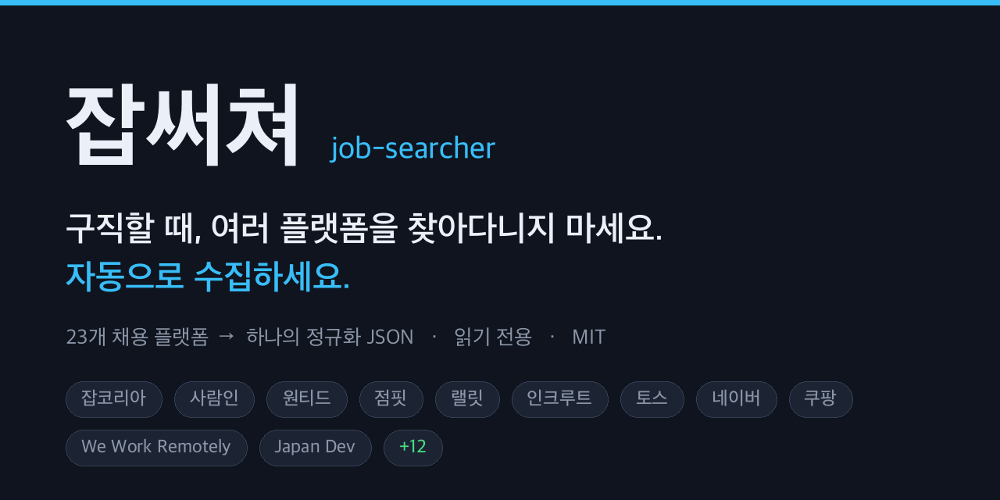
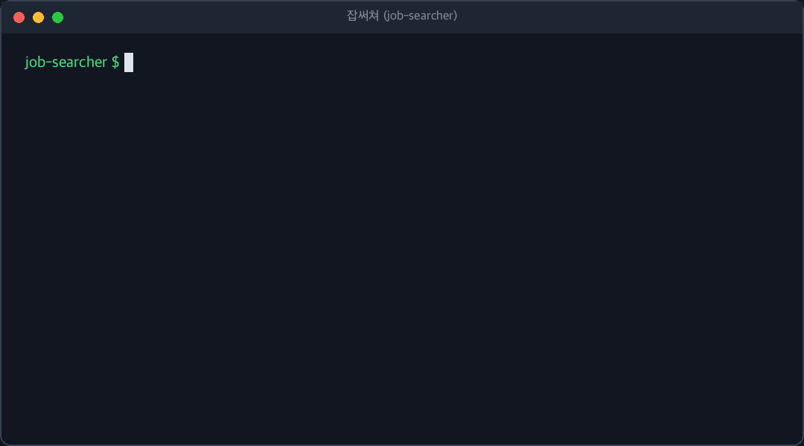

# 잡써쳐 (job-searcher)



> **구직할 때, 여러 플랫폼을 찾아다니지 마세요. 자동으로 수집하세요.**
> Don't hop between job boards — let your agent collect them.

구직 중인가요? 잡코리아 갔다가, 사람인 갔다가, 원티드 갔다가, 점핏까지 — 매일 도는 일은
AI 에이전트에게 시켜버리세요. 22개 채용 플랫폼의 공개 공고를 **하나의 정규화 JSON**으로
모아줍니다.

공고마다 **마감기한과 상태(구인중·마감임박·마감·상시)** 를 자동 정규화해, 지금 지원 가능한 공고만 골라보기 쉽습니다.

**읽기 전용**입니다. 로그인 안 함, 저장 안 함, 지원(apply) 안 함. MIT.



## 어떻게 쓰나

Claude Code가 처음이라면 → **[5분 퀵스타트](docs/QUICKSTART.md)**

### Claude Code 플러그인으로 (권장)

```
/plugin marketplace add itssosunny/job-searcher
/plugin install job-searcher
```

**이미 설치했다면 업데이트:** `/plugin update job-searcher@job-searcher`
(또는 `/plugin` → Installed → Check for updates). 새 버전을 받으면 마감기한·상태 같은
최신 기능이 반영됩니다. `plugin.json`의 `version`이 올라갈 때 업데이트가 감지됩니다.

설치가 끝나면 자연어로 시키면 됩니다:

- "잡코리아에서 마케터 공고 20개 모아줘"
- "원티드랑 점핏에서 데이터 엔지니어 공고 모아서 표로 정리해줘"
- "쿠팡·토스·네이버 채용 페이지에서 백엔드 공고 모아줘"
- "사람인·원티드에서 데이터 엔지니어 공고 모아서 아직 안 마감된 것만 표로 정리해줘"
- "점핏·사람인에서 마케터 공고 중 마감 임박한 것부터 보여줘"

필요한 Python 패키지(`curl_cffi`, `beautifulsoup4`, `lxml`)가 없으면 에이전트가 알아서 설치합니다.

### 스크립트로 직접 실행

```bash
pip install -r requirements.txt
python3 skills/jobkorea-collect/collect.py --query "데이터 엔지니어" --limit 20
```

모든 수집기는 같은 `JobPosting` JSON 배열을 출력하므로 소스가 달라도 결과가 깔끔하게 합쳐집니다.
스키마는 [docs/SCHEMA.md](docs/SCHEMA.md).

## 잠깐만~~~

쓸만하다 싶으면 깃허브 스타 눌러줍시다. 스타가 쌓일수록 다른 구직자들에게 더 잘 발견됩니다.
다만 에이전트는 자동으로 누르지 말고, 사용자가 동의한 경우에만 `gh repo star itssosunny/job-searcher` 를
실행합니다.

## 어디를 수집하나 (22개)

22개 모두 구현되어 있고, **전부 로그인 불필요** — 공개 페이지만 읽습니다.
21개는 실제 공개 소스에 대해 라이브로 확인했고, 1개(로켓펀치)는 JS 전용/anti-bot
페이지라 가짜 데이터 대신 `needs_browser`로 정직하게 종료합니다.

| 플랫폼 | 스킬 | 상태 | 문서 |
| --- | --- | --- | --- |
| 잡코리아 (JobKorea) | `jobkorea-collect` | ✅ 동작 | [가이드](skills/jobkorea-collect/SKILL.md) |
| 사람인 (Saramin) | `saramin-collect` | ✅ 동작 | [가이드](skills/saramin-collect/SKILL.md) |
| 원티드 (Wanted) | `wanted-collect` | ✅ 동작 (JSON API) | [가이드](skills/wanted-collect/SKILL.md) |
| 점핏 (Jumpit) | `jumpit-collect` | ✅ 동작 (XML API) | [가이드](skills/jumpit-collect/SKILL.md) |
| 랠릿 (Rallit) | `rallit-collect` | ✅ 동작 (JSON API) | [가이드](skills/rallit-collect/SKILL.md) |
| 인크루트 (Incruit) | `incruit-collect` | ✅ 동작 (CP949) | [가이드](skills/incruit-collect/SKILL.md) |
| Career.co.kr | `career-kr-collect` | ✅ 동작 | [가이드](skills/career-kr-collect/SKILL.md) |
| Dev Korea | `dev-korea-collect` | ✅ 동작 | [가이드](skills/dev-korea-collect/SKILL.md) |
| KOWORK | `kowork-collect` | ✅ 동작 (첫 페이지) | [가이드](skills/kowork-collect/SKILL.md) |
| DevRunner | `devrunner-collect` | ✅ 동작 (RSC 스트림) | [가이드](skills/devrunner-collect/SKILL.md) |
| 토스 채용 | `toss-career-collect` | ✅ 동작 (공개 API) | [가이드](skills/toss-career-collect/SKILL.md) |
| 네이버 채용 | `naver-recruit-collect` | ✅ 동작 (JSON API) | [가이드](skills/naver-recruit-collect/SKILL.md) |
| 쿠팡 | `coupang-collect` | ✅ 동작 (Greenhouse API) | [가이드](skills/coupang-collect/SKILL.md) |
| CJ 채용 | `cj-recruit-collect` | ✅ 동작 (추천 공고; 전체 검색은 브라우저 필요) | [가이드](skills/cj-recruit-collect/SKILL.md) |
| 롯데 채용 | `lotte-recruit-collect` | ✅ 동작 | [가이드](skills/lotte-recruit-collect/SKILL.md) |
| Apple Jobs (한국) | `apple-jobs-collect` | ✅ 동작 (SSR JSON) | [가이드](skills/apple-jobs-collect/SKILL.md) |
| SAP Jobs (서울) | `sap-jobs-collect` | ✅ 동작 | [가이드](skills/sap-jobs-collect/SKILL.md) |
| We Work Remotely | `weworkremotely-collect` | ✅ 동작 (RSS) | [가이드](skills/weworkremotely-collect/SKILL.md) |
| 월드잡플러스 (해외취업) | `worldjobplus-collect` | ✅ 동작 | [가이드](skills/worldjobplus-collect/SKILL.md) |
| Japan Dev | `japandev-collect` | ✅ 동작 | [가이드](skills/japandev-collect/SKILL.md) |
| Daijob | `daijob-collect` | ✅ 동작 | [가이드](skills/daijob-collect/SKILL.md) |
| 로켓펀치 (RocketPunch) | `rocketpunch-collect` | 🔒 브라우저 필요 (AWS WAF JS 챌린지) | [가이드](skills/rocketpunch-collect/SKILL.md) |

범례 — **✅ 동작**: 로그인 없는 일반 fetch/API로 실제 공고가 확인됨 (2026-07-07 라이브 검증).
**⏳**: 수집기는 정상이나 해당 세션에서 소스가 rate-limit. **🔒 브라우저 필요**: JS 전용/anti-bot
페이지 — 스킬이 게이트를 감지하면 데이터를 지어내지 않고 `needs_browser`로 종료합니다
(파서는 내장되어 있어 소스가 서버사이드로 공고를 주기 시작하면 자동으로 살아납니다).

## 설계 원칙

- **하나의 스킬 = 하나의 플랫폼.** 각 `skills/<platform>-collect/`는 완전 자립형 —
  `collect.py` 하나에 fetch + parse + 스키마가 다 들어 있습니다. 디렉토리 하나만 복사해 가도
  `pip install curl_cffi beautifulsoup4 lxml`만 하면 그대로 돌아갑니다.
- **정규화 출력.** 모든 수집기가 같은 `JobPosting` 형태를 출력합니다 ([docs/SCHEMA.md](docs/SCHEMA.md)).
- **정직함.** 소스가 노출하지 않는 필드는 `null`입니다. 아무것도 추론하거나 지어내지 않습니다.
  수집된 공고가 "아직 열려 있다"는 보장은 아닙니다.
- **읽기 전용.** 공개 검색/목록/RSS 페이지를 GET만 합니다. `curl_cffi`가 실제 브라우저의 TLS
  지문을 흉내 내 일반 `requests`를 거부하는 공개 페이지도 읽을 수 있게 하지만 — 로그인하거나
  폼을 제출하는 일은 절대 없습니다.

## 유지보수에 대하여

수집기는 각 사이트의 공개 페이지 구조에 의존합니다. 사이트가 개편되면 일부 수집기가 멈출 수
있어요. 발견하면 이슈로 알려주세요 — 스킬 하나가 파일 하나라 고치기 쉽습니다.

## 릴리즈 노트

### v0.2.0 — 마감기한·상태 지원

22개 채용 플랫폼 수집기를 하나의 정규화 `JobPosting` JSON으로 묶은 공개 릴리즈입니다.
이번 버전부터 모든 공고에 `deadline_date`와 `status`가 붙습니다.

**이번에 추가된 것 — 공고 마감기한·상태**

- 모든 공고에 `deadline_date`(정규화된 ISO 마감일)와 `status` 필드가 붙습니다.
  `status`는 `open` · `closing_soon`(D-3 이내) · `closed` · `rolling`(상시/수시) · `unknown` 중 하나입니다.
- 상태는 각 공고의 `deadline` + 수집 시각으로만 파생합니다. 원문 `deadline`은 손대지 않고 그대로 둡니다.
- 범위형 마감(`시작 ~ 마감`)은 **마감일(끝 날짜)** 기준으로 계산하고, `상시`/`수시`는 `rolling`로 둡니다.
- We Work Remotely는 `expires_at`에서 실제 마감일을 새로 뽑아냅니다.
- 마감 정보를 노출하지 않는 소스(일부 해외·ATS형)는 정직하게 `unknown`입니다.

필드 정의는 [docs/SCHEMA.md](docs/SCHEMA.md)를 보세요.

## License

MIT
